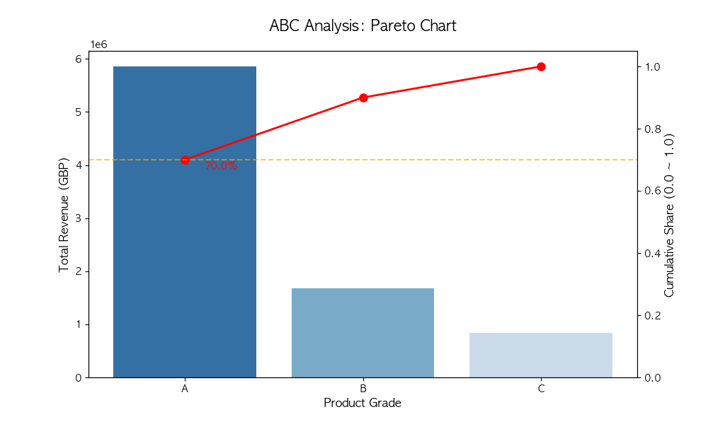

# E-Commerce 데이터 기반 ABC 재고 분석

## 1. 프로젝트 개요

본격적인 대용량 물류 데이터 분석에 앞서, Python과 SQL을 활용해 재고 관리의 기본이 되는 **'ABC 등급 분류 로직'**을 직접 구현하고 테스트해 본 사전 검증(PoC) 프로젝트입니다.

4,000여 건의 샘플 데이터를 활용해 데이터 정제부터 누적 비중 계산, 시각화까지의 전체 흐름을 코드로 구현했으며, 향후 진행할 대규모 'ABC-XYZ 재고 시뮬레이션 대시보드'의 핵심 엔진으로 활용할 예정입니다.

## 2. 사용 기술

- **Language**: Python 3.10+
- **Data Analysis**: Pandas, NumPy
- **Database**: SQLite3
- **Visualization**: Matplotlib, Seaborn

## 3. 프로젝트 구조 및 실행

### 📁 Directory Structure

```text
├── data/               # 원본 SQLite DB
├── notebook/           # 분석 및 로직 검증 코드 (.ipynb)
├── output/             # 파레토 차트 등 시각화 결과물
└── requirements.txt    # 라이브러리 의존성 목록
```

### ⚙️ How to Run

pip install -r requirements.txt

## 4. 분석 과정

1. **데이터 전처리 (SQL):** 원본 DB에서 취소 주문(C로 시작하는 Invoice)을 필터링해 순수 판매 데이터만 추출.
2. **지표 집계 (Pandas):** 상품별 총 판매량(`NetVolume`)과 총 매출액(`TotalRevenue`) 계산.
3. **ABC 등급 분류:**
   - 매출액 기준 내림차순 정렬 후 누적 비중(`CumShare`) 산출.
   - 누적 매출 비중에 따라 A등급(~70%), B등급(70~90%), C등급(90~100%)으로 타겟팅.
4. **시각화:** Matplotlib의 이중 축(twinx)을 활용해 파레토 차트 구현 (매출 불균형 직관적 확인).

## 5. 분석 결과



- 데이터 분석 결과, **전체 품목의 단 15%(약 535개)가 전체 매출의 70%를 차지하는 A등급**으로 분류되었습니다.
- 반면 전체 가짓수의 55%(약 2,200개)를 차지하는 C등급 품목은 총매출 기여도가 10%에 불과함을 확인했습니다.
- 이를 통해 소수의 핵심 품목(A등급)에 대한 집중 관리 및 출고장 인근 전진 배치 등, 물류 현장에서의 차등화된 재고 전략이 왜 필요한지 데이터를 통해 검증했습니다.

## 🔗 Data Source

- [Kaggle: E-Commerce Data (Actual transactions from UK retail)](https://www.kaggle.com/datasets/vijayuv/onlineretail)
